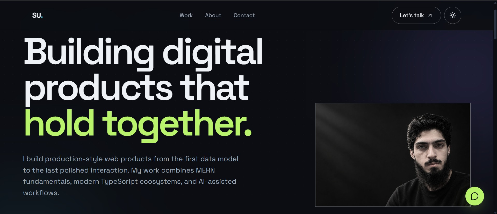
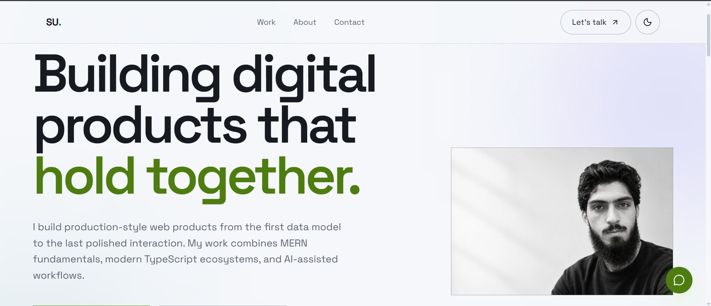

# Shams Ur Rehman — Portfolio

Portfolio website for **Shams Ur Rehman**, a full-stack developer building
production-style web products from the first data model to the last polished
interaction.

Live site: https://portfolio-website-plum-one-76.vercel.app/

Deployed on [Vercel](https://vercel.com). Pushing to `main` triggers an automatic rebuild and deployment.

## Screenshots

| Dark mode | Light mode |
| --- | --- |
|  |  |

## Features

- **Dark / light themes** — follows system preference, remembers your choice, and
  crossfades colors + the hero screenshot smoothly on every switch
- **Animated, responsive UI** — scroll-reveal and hover motion as CSS keyframes with a
  tiny lazy-loaded chunk (nothing heavy on the critical path)
- **Theme-aware hero** — the hero screenshot swaps between dark/light visuals with a crossfade
- **Contact form** — powered by [Web3Forms](https://web3forms.com), no backend needed;
  client-side validation, copy-to-clipboard email, and a mailto fallback
- **WhatsApp quick link** — floating button wired to WhatsApp
- **Performance-first** — Lighthouse: 100 accessibility, 100 best practices, 100 SEO,
  ~90–96 performance
- **SEO-ready** — meta/Open Graph/Twitter tags, robots.txt, semantic landmarks

## Tech highlights

- **5-section responsive layout** — navbar, hero, about, skills, projects, contact, footer in a single scroll
- **Theme system** — CSS custom properties + data-theme attribute, persisted in localStorage, zero flash on load
- **Performance** — Vite 8 bare modules, motion lazy-loaded, fonts preloaded; Lighthouse 100/100/100/~94
- **SEO** — semantic HTML, Open Graph, Twitter Cards, robots.txt, descriptive meta tags
- **Contact** — Web3Forms serverless, client-side validation, copy-to-clipboard, mailto fallback
- **Accessibility** — keyboard navigable, focus styles, ARIA where needed, 100 Lighthouse accessibility

## Tech stack

- React 19 + Vite
- Tailwind CSS 4
- lucide-react icons
- motion (lazy-loaded for scroll reveals)
- ESLint (flat config, react-hooks + react-refresh)

## Project structure
portfolio-website/
├── index.html            # Entry point with SEO meta tags
├── vite.config.js        # Vite 8 config, Tailwind plugin
├── eslint.config.js      # Flat ESLint config (react-hooks, react-refresh)
├── package.json          # React 19 + Tailwind 4 + Vite 8
├── src/
│   ├── main.jsx          # React 19 root, theme init
│   ├── App.jsx           # Theme provider, route-style section layout
│   ├── index.css         # Tailwind 4 imports, custom theme variables
│   ├── components/       # 11 isolated components (Navbar, Hero, About, ...)
│   └── data/
│       ├── profile.js    # Name, role, contact, summary
│       ├── skills.js     # Skill tags
│       └── projects.js   # Project cards data
├── public/               # favicon.svg, icons.svg, robots.txt
└── dist/                 # Production build output
```

## Deployment

This portfolio is deployed on [Vercel](https://vercel.com) at https://portfolio-website-plum-one-76.vercel.app/.

### Deploy yourself

1. Push this repo to GitHub.
2. Import it in [Vercel](https://vercel.com) (or connect the existing project).
3. Vercel auto-detects the Vite + Node build and deploys on every push to `main`.

```bash
# Build locally to verify before pushing
npm run build          # outputs to dist/
npm run preview        # serve dist/ locally
```

### Environment

No backend is required. The contact form uses [Web3Forms](https://web3forms.com) — add your access key to `src/data/profile.js` (see `.env.example`).

## Getting started

```bash
npm install    # install dependencies
npm run dev    # dev server with HMR
npm run lint   # run ESLint
npm run build  # production build to dist/
npm run preview# serve the production build locally
```
